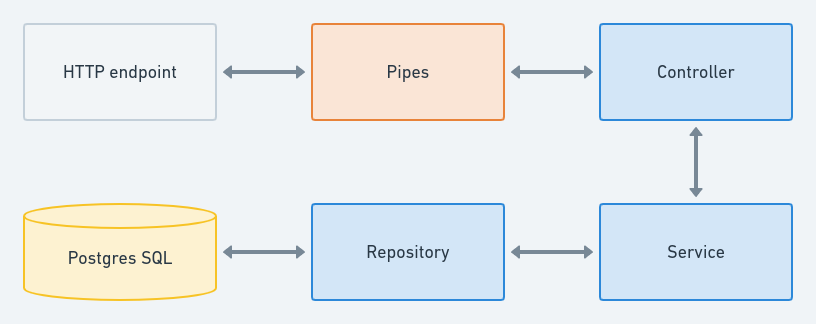

# 🐘 PARQ Api Nest y Postgres

Rest Api NestJS + Postgres SQL para usuarios y obtener sus coordenadas con la API de geolocalización de Google. Con auto documentación con Swagger.

## Contenido

Este proyecto tiene una rama: principal, contiene el producto final.
Llevando a cabo la estrategia de flujo de trabajo de git [desarrollo basado en troncos](https://trunkbaseddevelopment.com/)

## Instalación

### Cómo iniciar el contenedor y correr la API 🐘

```sh
# Levantar en desarrollo
docker-compose up dev

# Levantar para ambientes productivos
docker-compose up prod
```

> No olvide completar las variables de `.env.example` en `.env`

### Migraciones

```sh
# dev o prod según sea el caso
docker-compose exec dev bash
# Estando conectamos corremos las migraciones necesarias
```

> Mirar el `package.json` para ver todos los comando scripts de migraciones

## Data Flow



## Requerimientos

- [ ] Pruebas Unitarias.
- [x] Crear DockerFile para ejecución del código en container.
- [x] Documentación API.
- [x] Usar TypeScript.
- [x] End-points solicitados

## Documentación

La documentación se encuentra en el `/api/docs`, estando allí conocerá todos los endpoints y como usarlos
